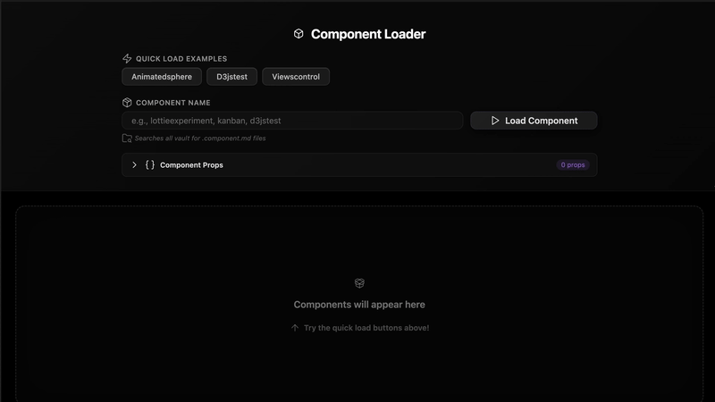
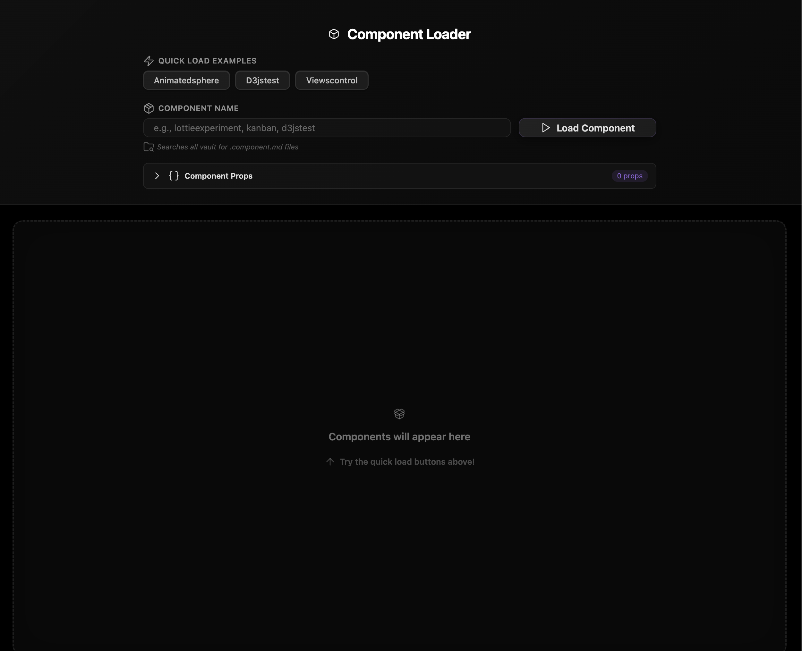

  
  
  <h1 align="center">VIEWS INCEPTIONS</h1>
  <h3 align="center"> The Dynamic Sandbox and Props Isolation Loader </h3>

  <!-- TOP PURPLE LINKS -->
  
  
  
   
  <!-- BOTTOM GOLD TAXONOMY -->
  
  
  
  

  

    <i> An advanced developer sandbox for dynamically loading, isolating, and interacting with other Datacore components using live prop injection. </i>
  

  

Welcome to **Views Inceptions**, the developer playground and component isolation harness built natively for Obsidian Datacore. Designed to accelerate testing and prototyping cycles, it resolves and executes component modules dynamically inside a secure parent layout frame. Featuring an active props evaluation panel and a continuous layout escape safeguard, it prevents isolated views from hijacking the parent leaf or leaking stylesheets into your vault configuration.

---

## Quick Start

To start trying Views Inceptions today:
1. **Download the Repository**: Clone or download this repository directly into any folder inside your Obsidian vault.
2. **Install Datacore**: Ensure you have the **Datacore** plugin installed and enabled in Obsidian.
3. **Open the Entry Note**: Open the **`VIEWS INCEPTIONS.md`** note inside Obsidian to launch the component!

---

## Features

### Dynamic Component Resolving
* **Fuzzy Directory Parsing**: Locates matching markdown components inside your vault instantly via keyword lookup.
* **Mock Environment Bridging**: Stub active file paths reactively to let loaded children resolve context files and configuration paths cleanly.
* **Hassle-Free Hot Loading**: Use quick buttons to cycle between preconfigured loader components or drag-and-drop markdown files directly onto the wrapper canvas.

### Real-Time Props Evaluation
* **Type-Aware Formatting**: Evaluates parameters into string inputs, integers, arrays, or JSON object formats on the fly.
* **Double-Click Modifier**: Click directly on properties keys inside the active debugger toolbar to adjust layout values and prompt instant component reload states.
* **State Preservation**: Persists property state across loading transitions for rapid interface refinement.

### Sandboxed Escape Safeguards
* **DOM Mutation Interception**: Monitors workspace structures and automatically reparents elements that try to escape container boundaries.
* **Robust Error Boundaries**: Catches child layout runtime exceptions cleanly to block screen freezes or parent vault tab crashes.

---

## Directory Index & Components

The package exposes the following files:

| File | Description |
| :--- | :--- |
| **[VIEWS INCEPTIONS.md](VIEWS%20INCEPTIONS.md)** | The main loader query note designed to be opened in Obsidian. |
| **[src/index.jsx](src/index.jsx)** | Safe Agent recovery bootstrapper script. |
| **[src/App.jsx](src/App.jsx)** | Core sandbox dashboard layout including the debug console. |
| **[src/components/DynamicComponentLoader.jsx](src/components/DynamicComponentLoader.jsx)** | Manages dynamic file compiling, boundary wrappers, and mutation tracking. |
| **[METADATA.md](METADATA.md)** | Packaging manifest outlining taxonomies and asset locations. |
| **[README.md](README.md)** | Comprehensive premium user documentation. |
| **[assets/image/preview_1.webp](assets/image/preview_1.webp)** | Sandbox dashboard layout static image. |
| **[assets/videos/preview.gif](assets/videos/preview.gif)** | Walkthrough loop animation showcasing sandboxed components loading. |

---

## Previews

| Card Layout | Interactive Sandbox Explorer |
| :---: | :---: |
|  |  |

---

## Contributors
- beto.group
